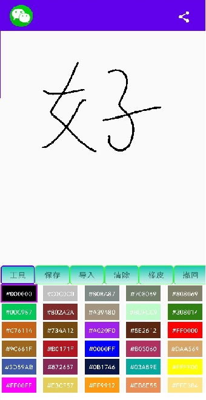

## 涂鸦 App

### 实现效果如下

### 相关知识点与博文
|相关知识点|博文链接|
|---------|--------|
|自定义view||
|Toolbar实现自定义Tiltle||
|Glide图型转换||
|RecycleView基本使用||
|ViewPager2的基本使用||
|Viewmodel实现多个Fragment之间的数据通信||
|ViewBinding的基本使用||
|动态权限声明||
|Dialog的基本使用||
|Bitmap相关知识点||
|调用系统相册基本实现||